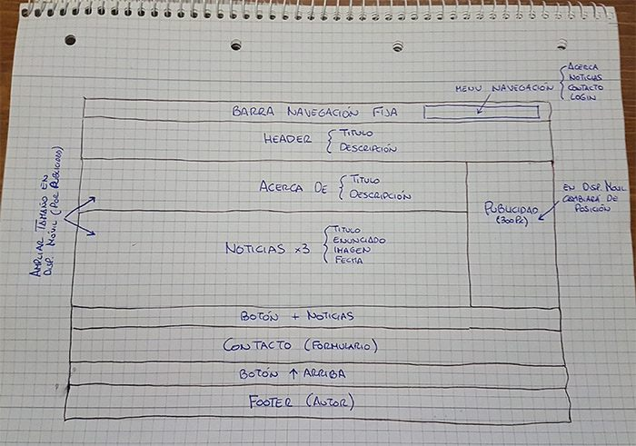

# LMSGI-07. Página web de noticias.
## Autor: Sebastián Marqués Pardo.
### Previsualización del proyecto: https://rawgit.com/SebasMTX/Web-noticias/master/index.html
#### Especificaciones del cliente:

- La maquetación (layer design) debe dejar 300 px de espacio a la derecha de la pantalla para publicidad si la pantalla es suficientemente ancha. Todo otro diseño es libre.
- Para dispositivos móviles, la publicidad irá fijada en la parte inferior o bien sólo aparecerá en la parte superior (y desaparecerá al hacer scroll) con un alto de 90px. Puedes elegir la opción. Todo otro diseño es libre.
- Los datos son: título (entorno a 8 palabras), imgbig (url al json, imagen en la carpeta), imgmid (url al json, imagen en la carpeta), descripción (mínimo de 300 caracteres), fecha y hora (datetime) .
- Todas las noticias deben tener el mismo formato y mostrar los datos especificados de forma elegante a todo dispositivo.

#### Tareas:

El proyecto solicitado se realizará distribuyendo el espacio en pantalla en la forma que se muestra en la siguiente imagen:

#### Creación de la página principal.

Se crea la página principal (_index.html_), conteniendo tres noticias iniciales redactadas en el mismo html. Para facilitar la implementación del diseño de la página proyectada se hará uso del conjunto de herramientas de código abierto _Bootstrap_ ya que contiene plantillas de diseño con tipografía, formularios, botones, cuadros, menús de navegación y otros elementos de diseño basado en HTML y CSS, así como, extensiones de JavaScript opcionales adicionales.

Cada noticia de las incluídas en la página consta de:

- Título de la noticia.
- Contenido de la noticia.
- Foto a tamaño reducido (de similares dimensiones en todas las noticias).
- Fecha de publicación.

Las fotos seleccionadas para las noticias se almacenan en una carpeta llamada _img_.

#### Creación de las páginas de noticias.

Se crean y codifican tres _html_ que nos permitirán leer cada una de las noticias antes redactadas, a página completa, cuando clicamos sobre el título de la noticia. Se incluirá la funcionalidad para regresar a la página principal al finalizar. La barra de menú superior mostrará al usuario la página en la que se encuentra y permitirá enlazar con la página principal. También se incorporará un botón al final de la noticia con el mismo fin.

Junto al contenido del artículo enlazado se incluye la foto de la noticia, a mayor resolución que en la página principal, que se adapta al tamaño de la pantalla. Así mismo se incluye un vídeo de la noticia, procedente de _**Youtube**_ con características _responsive_ (Adaptable al tamaño de pantalla). 

#### Archivos json.

Para almacenar 6 noticias más se reparten tres noticias, con sus respectivos contenidos, en cada uno de los archivos _json_ creados. Los archivos _json_ son almacenados en la carpeta _datos_ para ser consultados posteriormente mediante funciones _javaScript_.

#### JavaScript.

Se realiza la codificación de las funciones necesarias para: 

- Ocultar la publicidad cuando el tamaño de la pantalla del dispositivo es inferior a 768px y se inicia el scroll de la pantalla, mostrándose de nuevo cuando la pantalla se halle en su posición inicial (ScrollTop 0).
- Cargar las noticias contenidas en los dos archivos _json_ y se muestren al pulsar el botón de recarga de noticias. Con cada pulsación del botón se recargarán tres noticias, mostrándose un aviso en pantalla cuando no haya más noticias.

#### RSS.

Se crea el archivo que contiene los datos de las noticias, codificándol en _xml_ y almacenándolo posteriormente en la carpeta _rss_.

#### Open Graph.

 Cada página contiene las etiquetas meta (con open graph) para compartir:
 
 - Título
 - Descripción.
 - Imagen (en tamaño grande).
 - Nombre de la aplicación.
 - Url de la página.
 
#### Versión minified del proyecto

Se comprime y optimiza el código para mejorar tiempos de carga y tamaño de los archivos.

Rawgit de la versión minified: https://rawgit.com/SebasMTX/Web-noticias/minify/index.html
